# NamaGameOpen

## 何ができる？

ニコ生の生ゲームプレイ中のページ(https://site.live.nicovideo.jp/recent/namagame.html)で、遊びたいゲームが起動されたら、新しいタブで放送を開きます。

## なぜ作ったの？

あまり遊ばれないゲームをじっと待つのも大変なので、プログラムにチェックさせて、起動されたら開いてくれるようにしました。そうすれば、その間別のことができるようになります。

## 使えるブラウザは？

Chrome拡張です。よって、使えるブラウザはGoogle Chromeです。

## Chrome拡張のバージョンは？

Manifest Versionは3です。

## インストール

ニッチすぎるゆえ、Chromeストアに登録する気もなく、ソースをおいておきますので、興味あるかたは素性を確認するなり、他ブラウザ用に改造するなり、してください。Chromeで使う流れは以下の通り。

右上CodeよりDownload ZIPを選択

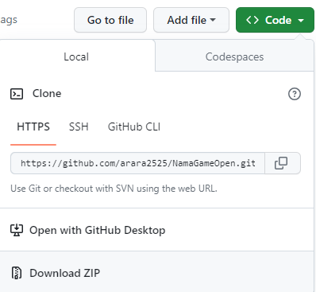

お好きな場所でZIPファイルを展開。

Chromeを起動し、"拡張機能を管理"を選択

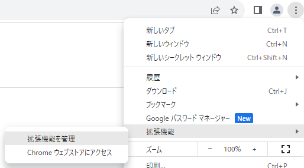

"パッケージ化されていない拡張機能を読み込む"を選択

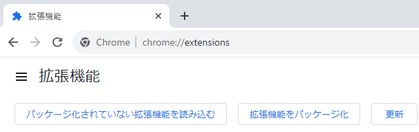

manifest.jsonファイルが入っているフォルダを開き、"フォルダの選択"を選択

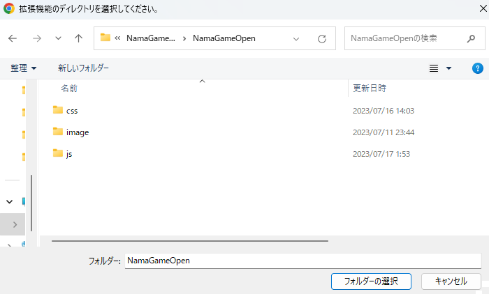

ただしく読み込まれたら、一覧に追加されます。

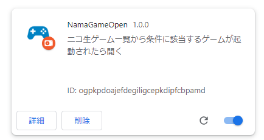

## 使い方

### シークレットモードについて
シークレットモードの方で使いたい場合は、"詳細"を選択し、"シークレット モードでの実行を許可する"を有効にします。

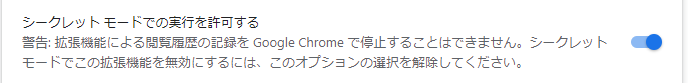

### ピン止め

ピン止めしておいた方が何かと便利なので、ピン止めの仕方について。ピン止めは、シークレットモードでは設定できないので、通常のブラウザを立ち上げて、パズルのアイコンを選択して、NamaGameOpenのピンを選択します。

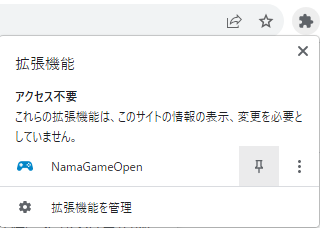

パズルアイコンの横にNamaGameOpenのアイコンが表示されます。

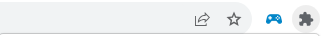

### プレイ中の番組

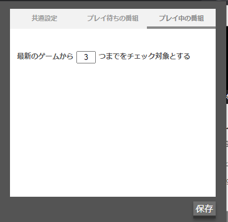
  
プレイ中の番組をすべてを対象とすると、終わる直前のゲームを開いたりしてもしょうがないので、最新のゲームからいくつまでをチェック対象にするかを指定できます。3つくらいが妥当だと思います。

### プレイ待ちの番組

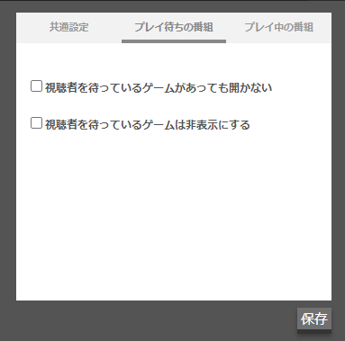

一応、チェック対象にすることもできるし、対象外にすることもできるようにしています。たぶん、対象外でよいと思います。

対象外にする場合は、視聴者を待っているゲームがあっても開かないにチェックをつけてください。

視聴者を待っているゲームは非表示にするは、生ゲーム一覧のページで非表示にします。

### 共通設定

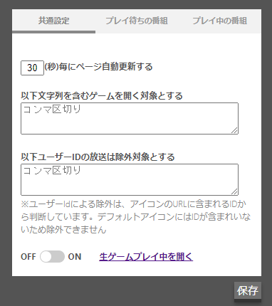

自動更新は、生ゲーム一覧のページを自動的に更新する間隔です。
たぶん、10秒くらいがちょうどよいと思います。個々の判断にお任せします。

ゲームを開く対象の欄は、ゲーム名の一部または全部を記載します。複数指定したい場合は、コンマ区切り(半角)で記載してください。

例：だるま,コッキート,コインクロス,カラータイル

ユーザーIDについては、仲間内でひっそりと楽しんでいるところに知らない人が来るのを嫌がる放送もあるので、そういうところを開きたくない場合は、UserIDを指定してください。こちらもコンマ区切り(半角)で複数指定できます。UserIDは、生ゲーム一覧のページに追記していますのでそちらをコピペしていただければよいです。

注：UseIDの判定は、アイコンのパスに含まれるUserIDから判定しています。デフォルトのアイコンの場合、運営が用意しているパスになっているため、UserIDが一覧の画面からは取得できないため、除外することはしていません。

OFFの間は、プログラムは動作しません。ONにした状態で、生ゲーム一覧のページを開くと、一定時間ごとに更新し、設定に該当するゲームが起動あれば新しいタブで開き、停止します(ゲーム中に次々にタブが開かれても困るので)
ゲームが終わりまたプログラムを再開させたい場合は、新たにページを開きなおせばまた自動更新が再開されます。

設定を選択するまでは、プログラムに反映されないため、変更したら設定を選択してください。次の画面更新から有効になります。

生ゲーム一覧のページを開くためのリンクもつけてあるので、そちらから開くと楽です。

## ライセンス
MIT License
